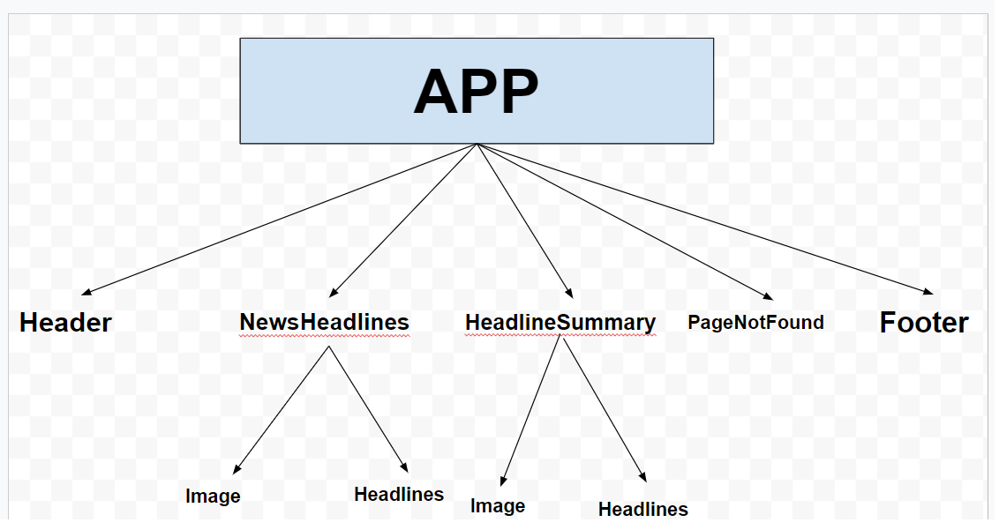
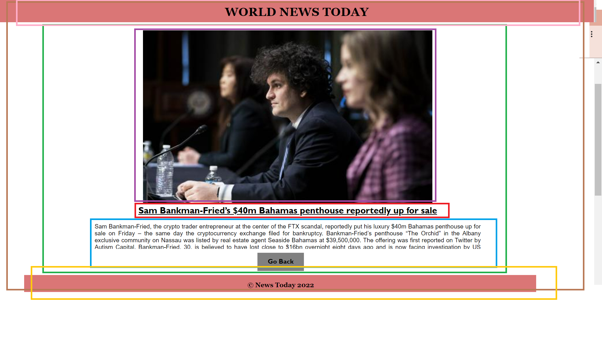

# News Summary Challenge

### Task

You'll test-drive a single page application in React that send requests to the Guardian API to get Headline and Article data and display them.

### Serving your app

You'll use React's toolchain to take care of serving your HTML, CSS and JavaScript files.

## User Stories

Some of these stories will need decomposing if they seem too large.

### Standard

```
As a busy politician
So I know what the big stories of the day are
I can see all of today's headlines in one place
```

```
As a busy politician
So that I have something nice to look at
I can see a relevant picture to illustrate each news article when I browse headlines
```

### Extended

```
As a busy politician
So that I can get an in depth understanding of a very important story
I can click a news headline to see a summary and a photo of the news article
```

```
As a busy politician
So I can get a few more details about an important story
I can see click a news article summary title which links to the original article
```

```
As a busy politician
Just in case my laptop breaks
I can read the site comfortably on my phone
```

```
As a busy politician
To make my news reading more fun
I can see whizzy animations in the app
```

## Mockups

### Headlines page


### Article summary page


## API

### API request rate limits and stubbing

The Guardian and Aylien text summarisation APIs are severely rate-limited.

**Please stub your tests so you don't exceed the daily limit. Otherwise, all requests will be rejected and your app will stop working!**

### Guardian API example

**Please stub your tests to avoid exceeding the API rate limit**

If you wanted to get the content of an article from the Guardian API, this is the cURL request you might make. Notice how it has a query parameter for `api-key`.

```sh
# Search endpoint
curl "https://content.guardianapis.com/search?q=coronavirus&show-fields=body&api-key=API_KEY"
```

```sh
# Single Item endpoint
curl "https://content.guardianapis.com/world/2021/mar/22/link-between-diabetes-and-coronavirus-infections?show-fields=body&api-key=API_KEY"
```

#### Example request data

[Mock Data](./mockNewsData.json) - contains a request to the Guardian API with fields selected that will help you with the challenge. The actual request made was to:

https://content.guardianapis.com/search?order-by=newest&show-fields=byline%2Cthumbnail%2Cheadline%2CbodyText&api-key=INSERT_YOUR_KEY_HERE

You will need to replace `INSERT_YOUR_KEY_HERE` with your own Guardian API key. Use this data whilst developing, serving it from `json-server` - it will help on the request rate limit in the API.

# News Challange Start

```
Run the dependencies on your root folder :-
npm install

Start the server :-
npm start

```

## Component Hirarchy



### User Story 1 and User Story 2(Acceptance criteria)


| Component        | Colour                                    |
| ---------------- | ----------------------------------------- |
| **App**          | <span style="color:blue ">Blue</span>     |
| **Header**       | <span style="color:red ">Red</span>       |
| **Image**        | <span style="color:brown ">Brown</span>   |
| **Headline**     | <span style="color: Green">Green</span>   |
| **NewsHeadline** | <span style="color:Grey ">Grey</span>     |
| **Footer**       | <span style="color:Orange ">Orange</span> |

### Files and tests for my above components

```
App.jsx/App.test.js

Test:-
App component renders correctly
```

```

Header.jsx/Header.test.js

Test :-
Header should match the snapshot.

```

```

Footer.jsx/Footer.test.jsx

Test:-
Footer should match the snapshot.

```

```

NewsImage.jsx/NewsImage.test.js

Test:-
It should render image passed as props with attributes(src,alt)

```

```

Headlines.jsx/Headlines.test.js

Test:-
It should render the passed headline prop with id

```

```

NewsHeadlines.jsx/NewsHeadlines.test.js

Test:-
Testing if the actual array length is matching with mock.json file length

```

### Steps to run the server on different port

```

npm install -g json-server
npx json-server --watch -p 3333 .json

```

### Installing the axios for https request

```

npm i axios

```

## Component Hirarchy

### User Story 3 and User Story 4(Extended Criteria)



| Component           | Colour                                    |
| ------------------- | ----------------------------------------- |
| **App**             | <span style="color:brown ">Brown</span>   |
| **Header**          | <span style="color:pink ">Pink</span>     |
| **Image**           | <span style="color:purple ">Purple</span> |
| **Headline**        | <span style="color: red">Red</span>       |
| **HeadlineSummary** | <span style="color:blue ">Blue</span>     |
| **Footer**          | <span style="color:yellow ">Yellow</span> |

```
PageNotFound.jsx/PageNotFound.test.js

Test :-
Page Not Found should match the snapshot.

```

```
HeadlineSummary.jsx/HeadlineSummary.test.js

Test:-
HeadlineSummary component renders correctly

```
